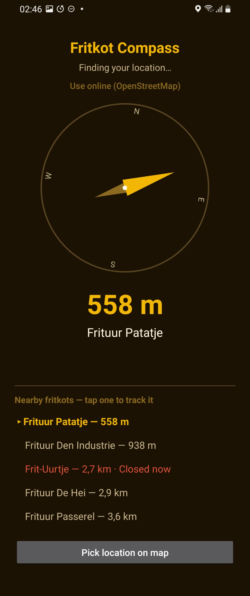

# Fritkot Compass

A small native Android app: point your phone and an arrow shows you the direction
and distance to the nearest fritkot / frituur / friterie in Belgium, using live
data from OpenStreetMap.



- **Compass**: rotates with your phone (rotation vector sensor) and always points
  toward the nearest fritkot, not north.
- **Distance**: shown in metres/kilometres, updates as you move.
- **Live data**: queries the public [Overpass API](https://overpass-api.de) for
  OSM nodes tagged as Belgian fry shops (`amenity=fast_food` + `cuisine=friture`,
  with a name-based fallback for untagged ones) within 30 km, re-querying as you
  move more than 300 m.
- **Offline fallback**: if there's no connection, a bundled dataset
  (`app/src/main/assets/fritkots_fallback.json`) is used instead so the app
  still shows something — see [Offline dataset](#offline-dataset) below for
  how it covers all of Belgium, not just one region. The app only ever
  *reads* this file at runtime — it's packaged inside the APK as a read-only
  asset, so nothing the app does while running can change or overwrite it;
  refreshing it is a separate, deliberate step you take (see below), not
  something that happens as a side effect of using the app.
- **No external libraries**: no AndroidX, no Google Play Services, no
  network/JSON libraries — just the Android platform SDK and Kotlin's standard
  library. This keeps the build minimal and easy to reproduce.
- **Dutch, French and English** strings included, since it's a Belgian app.

## Getting the installable APK

This project builds automatically via **GitHub Actions** every time it's
pushed — GitHub's build servers do the actual compiling, so you don't need
Android Studio installed anywhere. That's the recommended way to get a real
APK onto your phone (see *why* below).

1. Create a new **public or private** repository on GitHub (an empty one —
   don't initialize it with a README).
2. Upload this project's contents to it. Easiest ways:
   - **No git needed**: on the new repo's page, click **"uploading an existing
     file"**, then drag the whole extracted folder's contents in. GitHub
     supports dragging a folder in Chrome/Edge.
   - **With git**, from inside the extracted folder:
     ```
     git init
     git add .
     git commit -m "Fritkot Compass"
     git branch -M main
     git remote add origin https://github.com/<your-username>/<your-repo>.git
     git push -u origin main
     ```
3. Go to the repo's **Actions** tab. A "Build APK" run starts automatically
   and finishes in a couple of minutes. Open it, scroll to **Artifacts**, and
   download `fritkot-compass-debug-apk` — that's a real, signed, installable
   APK (zipped; unzip it to get `app-debug.apk`).
4. To get a **permanent shareable download link** instead of an Actions
   artifact (artifacts expire after 90 days), create a tag and push it —
   this makes the workflow publish a GitHub **Release** with the APK attached:
   ```
   git tag v1.0.0
   git push origin v1.0.0
   ```
   The APK will then sit at a stable URL under your repo's **Releases** page
   that you can send to anyone.
5. On your Android phone, download the APK (e.g. open the Release link in
   Chrome) and tap it to install. You'll need to allow "install unknown apps"
   for your browser the first time — Android will prompt you for this
   automatically.

Every future push to `main` rebuilds the APK the same way, signed with the
same key (see below), so re-installing an updated version works cleanly.

### Why GitHub Actions, rather than a prebuilt APK attached here

Compiling a modern Android app needs Google's Android SDK and Maven
repositories, which the environment this project was built in cannot reach
(they're not on its network allow-list). Everything in this project — all
the Kotlin source, resources, and the Gradle build files — has already been
verified locally: the resources were compiled with `aapt` and the Kotlin
source was fully type-checked against a real Android platform SDK (including
resolving every `R.id` / `R.string` / `R.layout` reference), so there's very
high confidence it's correct. What couldn't be done in that environment is
the final packaging step (turning compiled classes into a signed `.apk`),
which needs Google's dependencies to download. GitHub Actions runners have
normal, unrestricted internet access, so pushing this project there and
letting the included workflow build it is genuinely the most reliable way to
get a working APK — and it means every future change gets rebuilt the same
way automatically.

If you'd rather build it locally: open the project folder in Android Studio
(Giraffe or newer) and click Run, or from a terminal with the Android SDK
installed run `./gradlew assembleDebug`.

## Offline dataset

The app's primary data source is always the live Overpass query — the
offline dataset only kicks in when the phone has no connection. Belgium has
no single official fritkot registry, so this dataset comes from
OpenStreetMap, the same source the live query uses.

**`scripts/fetch_fritkots.py`** queries Overpass for *every* node in Belgium
tagged as a fry shop — one country-wide query (via OSM's `ISO3166-1=BE`
area), so Brussels, Flanders and Wallonia are all covered by construction
rather than by listing cities by hand. It writes the result straight into
`app/src/main/assets/fritkots_fallback.json` in the format the app expects
(name, coordinates, address).

The environment this project was originally scaffolded in has a locked-down
network that can't reach OpenStreetMap's services at all, so it could only
ship a small, hand-picked seed (a few well-known Brussels fritkots plus
generic placeholder pins for the other provincial capitals) as the in-repo
starting point — replace it with the real dataset using one of the two
options below (typically well over a thousand entries once refreshed).

**The build itself (`build.yml`) does not re-fetch this on every push or
release** — it just packages whatever `fritkots_fallback.json` is already
committed, so ordinary builds are fast and don't depend on Overpass being up.
Refreshing the dataset is a separate, deliberate step, since fritkots don't
open/close often enough to need refetching on every release. Two ways to do
it:

1. **Run it yourself, whenever you like**, from any machine with normal
   internet access, then commit the result like any other change:
   ```
   python3 scripts/fetch_fritkots.py
   git add app/src/main/assets/fritkots_fallback.json
   git commit -m "chore: refresh offline fritkot dataset"
   git push
   ```
2. **Trigger the "Refresh offline dataset" GitHub Actions workflow**
   (`.github/workflows/refresh-dataset.yml`) from the repo's Actions tab —
   click it, hit "Run workflow", and it fetches and commits the refreshed
   file for you, no local Python needed. It also runs automatically on the
   1st of each month by default; delete the `schedule:` block in that file
   if you'd rather it only ever run when you trigger it by hand.

## Signing

`debug.keystore` at the repo root is a fixed (non-secret) signing key checked
into the project so every CI build produces an APK with the *same* signature —
without this, each GitHub Actions run would generate a random debug key and
a new build would refuse to install over an older one. This is fine for
sharing an app directly; it is **not** meant for submitting to the Google
Play Store (Play requires you to generate and keep your own private release
key).

## Publishing further

- **Direct APK download** (what's set up here): share the GitHub Release
  link. Anyone can install it after allowing "unknown apps" for their
  browser once. No account or fee needed.
- **Google Play Store**: requires your own Google Play Developer account
  (one-time $25 fee, identity verification) since only you can create and
  own that account. If you want this later, the release APK build in the
  Actions workflow is the starting point — it would need a real release
  signing key instead of the debug one above, and a store listing.
- **F-Droid**: a free, no-account open-source app store. Submission is a
  pull request to F-Droid's own repo under your GitHub account, and review
  can take days to weeks — worth doing later if you want wider organic
  reach without a Play account.

## Privacy

Your location is used only on-device to compute distance/bearing and as the
centre point of the Overpass query — it isn't sent anywhere except as
latitude/longitude in that query to the Overpass API (a public OpenStreetMap
service), and nothing is stored or tracked by the app itself.

## Project layout

```
app/src/main/java/be/fritkot/compass/
  MainActivity.kt     – permissions, location updates, sensor handling, UI wiring
  CompassView.kt       – the custom compass dial + arrow drawing
  OverpassClient.kt     – Overpass API query + offline fallback
  GeoUtils.kt            – haversine distance / bearing math
  Fritkot.kt              – data classes
app/src/main/assets/fritkots_fallback.json  – offline dataset (see Offline dataset)
app/src/main/res/                             – layout, strings (en/nl/fr), colors, icon
scripts/fetch_fritkots.py                       – (re)generates the offline dataset from OSM
.github/workflows/build.yml                       – CI build (builds + release-on-tag only)
.github/workflows/refresh-dataset.yml               – refreshes the dataset (manual or monthly)
```

## License

Licensed under the [GNU General Public License v3.0](LICENSE) or later.
That means anyone is free to use, study, modify, and redistribute this app,
including commercially — but any redistributed version (modified or not)
must also be licensed under the GPL and come with its source code. See the
[`LICENSE`](LICENSE) file for the full terms.
